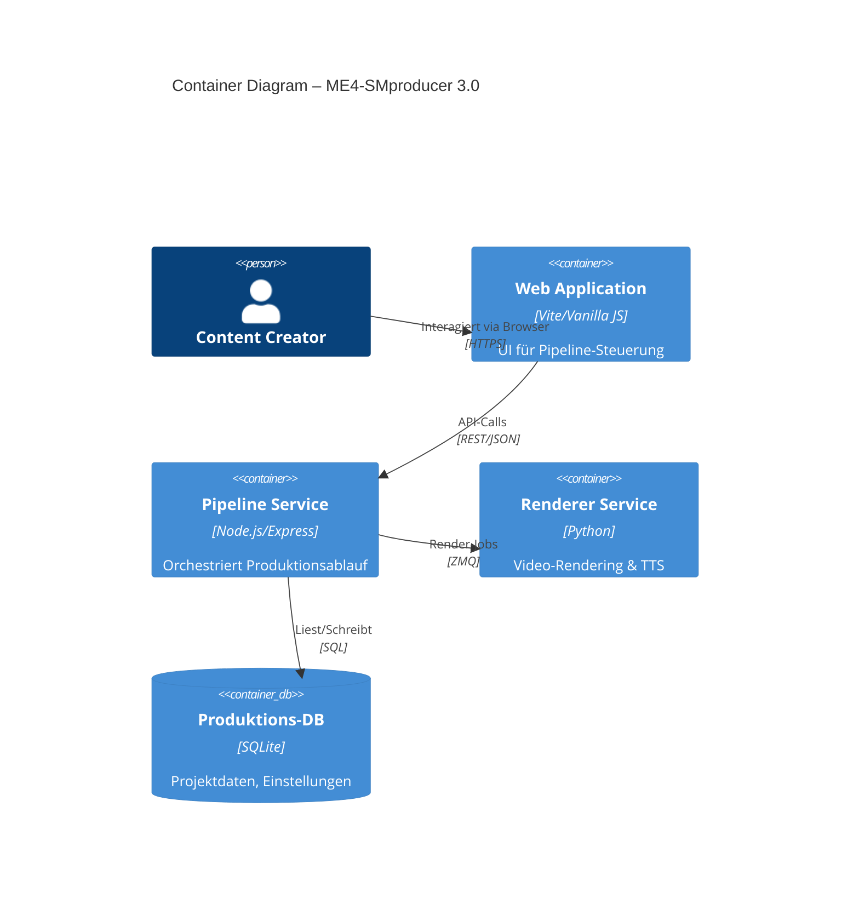

# C4 Container – ME4-SMproducer 3.0

## Container-Beschreibung

| Container | Technologie | Beschreibung |
|---|---|---|
| Web Application | Vite, Vanilla JS | Single-Page-App für den gesamten Produktions-Workflow |
| Pipeline Service | Node.js, Express | Zentrale Steuerung: Job-Queue, Status-Tracking, API |
| Renderer Service | Python 3 | CPU-intensive Aufgaben: Video-Encoding, TTS, Bildverarbeitung |
| Produktions-DB | SQLite (better-sqlite3) | Persistenz für Projekte, Templates, Einstellungen |
