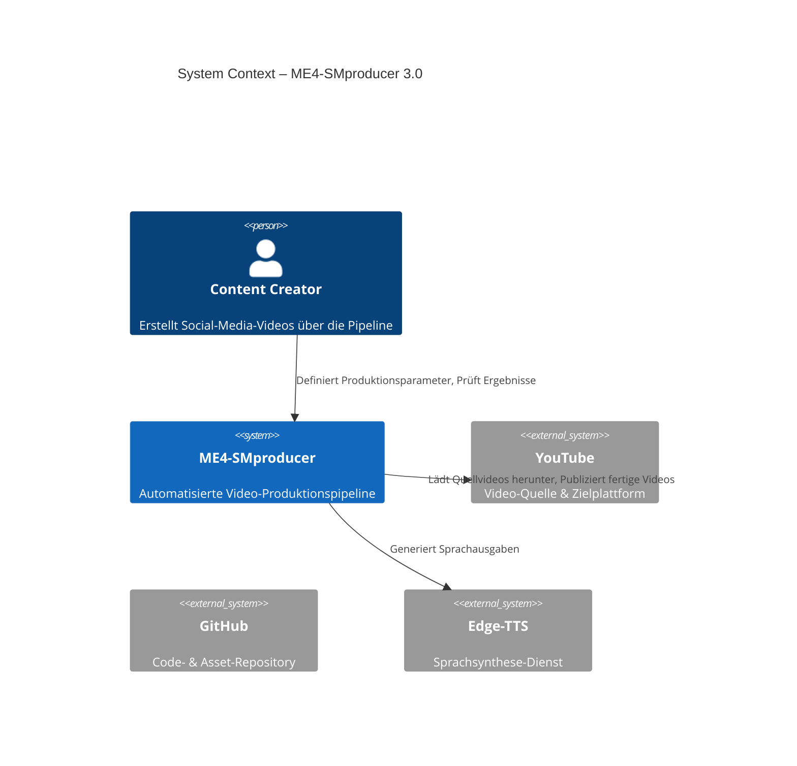

# C4 Context – ME4-SMproducer 3.0

## Systemkontext

## Systemverantwortung

| System | Verantwortung |
|---|---|
| ME4-SMproducer | End-to-End Videoerstellung: Recherche → Script → TTS → Rendering |
| YouTube | Quellmaterial & Veröffentlichung |
| Edge-TTS | Sprachsynthese für Voiceover |
